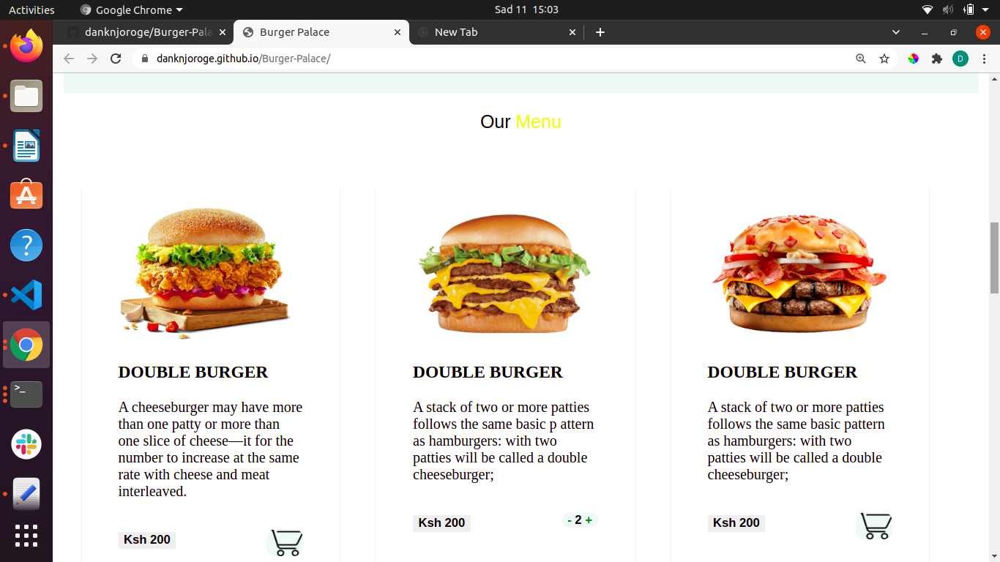

# Burger-Palace
### Daniel Njoroge
## Description
This is a simple landing page for a burger palace website.
## Screenshot

## Setup/Installation Requirements
* Clone the repository to your computer from 
        https://github.com/danknjoroge/Burger-Palace.git
* Open the project using your preferred code editor, preferrably visual studio code.
* Open the project using a web browser, preferably Google Chrome.
## Known Bugs
There are no known bugs
## Technologies Used
HTML 
CSS
## Support and contact details
For any query or in case of any support, you can reach me through.
* dank8505@gmail.com
### License
This project is under [MIT](LICENSE).
## Coraborators
Daniel Njoroge
